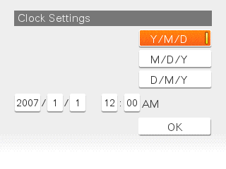
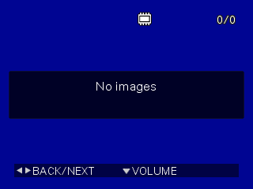
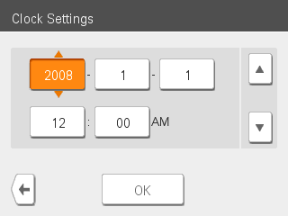
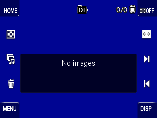
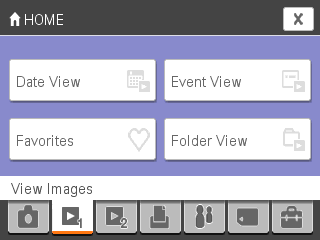

# OpenMemories: Continuous Integration

This repository emulates several Sony cameras in [qemu](https://github.com/ma1co/qemu). The tests run automatically on GitHub Actions.

## Screenshots

### CXD4108

#### DSC-T100

#### DSC-G3

